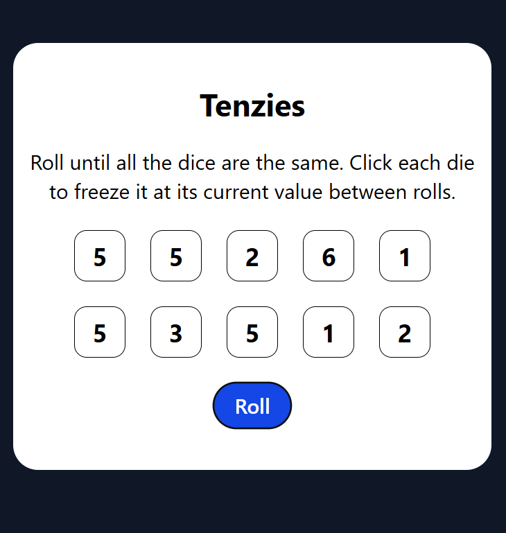

# Tenzies Game – React

A fun and interactive version of the classic **Tenzies** game built using **React**, **Vite**, and **TailwindCSS**.
The goal: Roll until all dice have the same value. Click each die to **freeze** it between rolls.

---

## 📂 Project Structure

```
tenzies-project/
├── public/               # Static assets
├── src/
│   ├── assets/           # Images and media (unused in current build)
│   ├── components/
│   │   └── Dice.jsx      # Single die component
│   ├── App.css           # Optional component-specific styles
│   ├── App.jsx           # Main game logic and UI
│   ├── index.css         # Tailwind and global styles
│   ├── main.jsx          # Entry point
├── package.json          # Dependencies and scripts
├── vite.config.js        # Vite configuration
└── README.md             # Project documentation
```

---

## 🚀 Features

* **Win condition detection** – Automatically detects when all dice are the same and held.
* **Randomized dice rolls** – Rolls all non-held dice with values between **1 and 6**.
* **Hold functionality** – Click on a die to lock its value.
* **Victory celebration** – Confetti animation on win.
* **New game button** – Resets the game instantly.
* **Responsive design** – Styled with **TailwindCSS** for mobile and desktop.

---

## Tech Stack

* **React** (Functional components + Hooks)
* **Vite** (Fast dev server & build tool)
* **TailwindCSS** (Utility-first styling)
* **NanoID** (Unique ID generation for dice)
* **React-Confetti** (Victory animation)

---

## Installation & Setup

1. **Clone this repository**

   ```bash
   git clone https://github.com/Molo-M/tenzies-project.git
   cd tenzies-project
   ```

2. **Install dependencies**

   ```bash
   npm install
   ```

3. **Run the development server**

   ```bash
   npm run dev
   ```

4. **Open in browser**

   * Visit the local server link provided by Vite (e.g. `http://localhost:5173`).

---

## How to Play

1. Click **Roll** to roll all dice.
2. Click any die to **hold** its value between rolls.
3. Continue rolling until **all dice are the same** and **all are held**.
4. Celebrate your win 🎉 and click **New Game** to start over.

---

## Screenshots



---

## 📄 License

This project is open source under the [MIT License](LICENSE).

---
